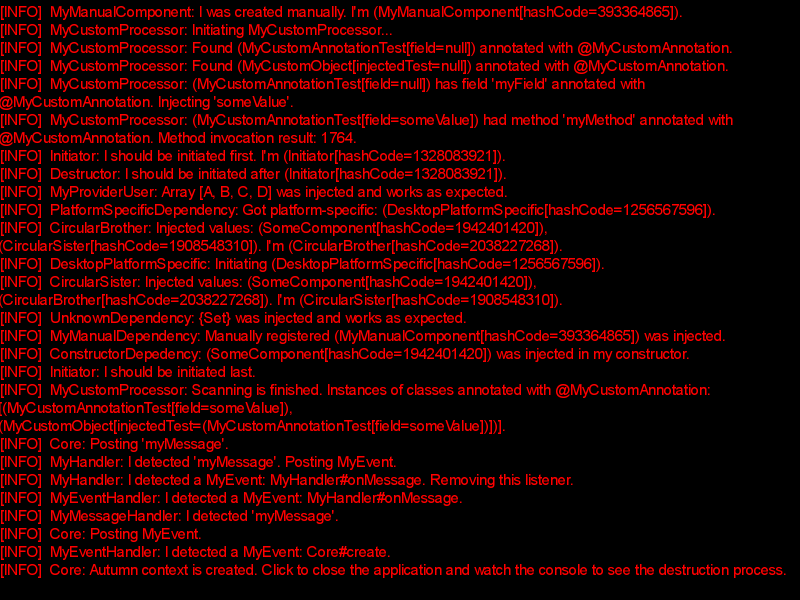

# LibGDX Autumn

This project demonstrates usage of `gdx-autumn` library: a cross-platform dependency injection mechanism using LibGDX reflection API. Being an API usage example, this application does not do very much except for documenting the whole context initiation and destruction process with multiple logs.

Involves some heavy, advanced usage of `gdx-kiwi` loggers - this application uses a custom `Logger` implementation. If you ever used a Java logger though, everything should be pretty clear.

Note that while `gdx-autumn` works on Android, such project was not included for simplicity. Check out `gdx-autumn-mvc-simple` example for a working Android application using *Autumn* (along with *Autumn MVC*).

Things to consider:

- Thanks to automatic component scanning, the application is highly modular. It would be easy to extract most of this application's components (as useless as example classes might be) to another project and they would just work.
- `@Initiate` and `@Destroy` annotations allow to fully control the order of components initiation. You might have to move some logic from constructors to initiation methods, though.
- Autumn events API solves the problem of communicating between components without direct references to each other.
- Did you notice that there are about 20 components (basically local-scoped singletons) communicating with one another and `Core` class knows about, like, *one*?
- Adding new components is super easy, as they are automatically scanned for, initiated and filled. No more manual object creation, yay.

