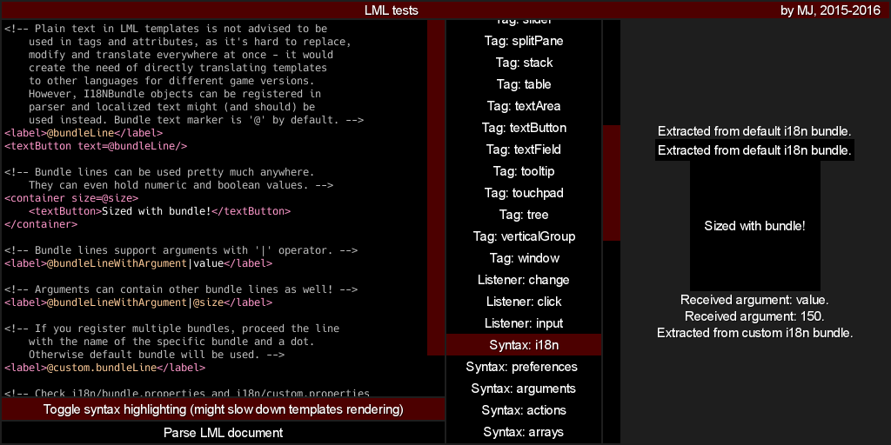

# LibGDX Markup Language
See [gdx-lml](../../lml).

This is an example project using LML templates to create GUI. Java part of the code explores some of the more advanced `gdx-lml` functionalities, like creating custom tags, macros and attributes. Example templates include usage of pretty much every tag and macro available in `gdx-lml` by default.

Check it out [on-line](http://czyzby.github.io/gdx-lml/lml) (be careful through: on-line version might be slightly outdated or use latest snapshot with new features).

It uses a simple, custom UI skin defined at `core/assets/skin.json`. The design is (somewhat) based on the great `VisUI` library, but obviously not as complex or polished. It has pre-defined styles for all default `Scene2D` actors, so it can be useful for quick prototyping - if you want to use these assets in your project, feel free to do so. You can modify raw skin assets at `core/raw` and run `gradle pack` task to recreate the atlas file with your changes.

