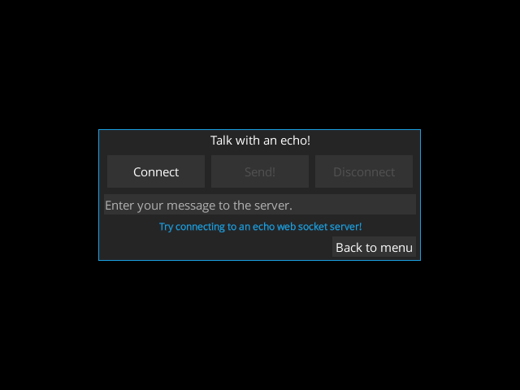

# Libraries usage example

This project demonstrates usage of `gdx-lml` (with `VisUI` widgets provided by `gdx-lml-vis`) to handle application's views and a somewhat practical usage of `gdx-websocket`: connecting to an external echo server. `gdx-kiwi` utilities are used all over the place to ease handling of assets and heavy objects. Contrary to simple test projects, this one aims to simulate an actual application.

LML is used to construct all screens - not a single actor is created with pure Java in this project. `LmlApplicationListener` is used to manage the views.

`Core` class manages current list of existing views. The application currently consists of 4 views:

- `Menu`: the first view - and a simple one at that. Allows to, well, go to other screens.
- `Calculator`: a classic view example. Demonstrates the use of LML and "communication" between Java and LML templates.
- `Echo`: web socket usage example. Connects to an external web socket echo server and allows the user to message it, while watching its responses and any major status changes. Make sure that the website is up and you can connect with it though - no guarantees! (Especially if you're not connected to the web.)
- `Images`: a proof of concept - simple example of using both LML-powered `Scene2D` and additional "external" assets. Displays a few images. And not much else.

Check it out [on-line](http://czyzby.github.io/gdx-lml/lml-vis-websocket).

