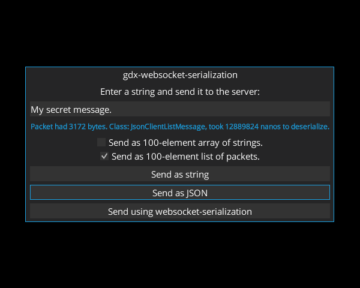

# gdx-websocket-serialization

This is a simple example of a web socket based communication between the server and the clients, exchanging packets serialized with [`gdx-websocket-serialization`](../../websocket/natives/serialization). It allows to compare its performance with other common serialization methods. Note that it does not come packed with Gradle wrapper, so make sure to install it on your own.

Client uses *LibGDX* (obviously) along with [`gdx-websocket`](../../websocket) to communicate with the server and [`gdx-lml-vis`](../../lml-vis) to create GUI. Desktop uses `gdx-websocket-common` natives library, while GWT project depends on `gdx-websocket-gwt`. Server is built with a few lines of code thanks to the amazing *Vert.x* framework.

### Running the application

The client application allows you to send a message as a simple string, `JSON` object or data serialized with `gdx-websocket-serialization`. Server will respond with the amount of bytes it received and how long it took to deserialize the packet (if the server was able to determine its type in the first place).

You can check out application's behavior without an IDE thanks to Gradle tasks:

- `gradle server:run` launches the server.
- `gradle desktop:run` launches desktop client. Note that `gdx-websocket-common` library should also work on Android (hence the name), so Android code and dependencies would be similar.
- `gradle html:superDev` compiles GWT application and provides the web client version on `8080` port. Visit `http://localhost:8080/html` to check it out.

Note that this example sends data as byte arrays. Although binary format might not be supported by some browsers, WebGL would probably be unavailable there anyway, so this is the preferred way. If you want to send JSON data as string web socket frames, use `WebSocket#setSerializeAsString` method.

Things to consider:

- When asked to send a simple message, string test sends passed text unmodified. When trying to send an array of strings, it will merge array's elements with a single character separator and send the result as string. If list of messages is requested, it will create an `Array<String>` with selected elements and send the result of its `toString()` method. This test aims to show how many bytes (roughly) are needed to send the raw data.
- Neither `gdx-websocket-serialization` or JSON serializer are fully optimized. `Json` could use fully minified format, which is likely to be unparseable when not using LibGDX `Json` API - prohibiting from use of other server-side JSON utilities. Also, class aliases could be used, but it would require additional manual registration on both the server and the clients. If JSON packets implemented `Json.Serializable` interface, their serialization process could have been optimized and stop being reflection-based - but then again, it requires additional work similar to implementing `Transferable` interface from `gdx-websocket-serialization`, so you might as well go with the other solution. By knowing the exact max size of expected messages beforehand, packets dedicated to `gdx-websocket-serialization` could use less bytes to serialize lengths of passed strings.
- `gdx-websocket-serialization` has small overhead over the raw data in this particular example. Equivalent JSON packets often have more bytes when serialized. Note that `String` objects were used as the main data type: this is something that JSON is rather good at serializing efficiently (as opposed to numbers, for example).
- This is *not* a benchmark. It does *not* aim to prove that either of the solutions is wrong. Actually, `JsonSerializer` does reasonably well (*Good Enough TM*), considering the reflection use - especially after a warm-up. Both serializers should be taken into consideration when designing your application.

