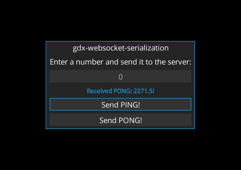

# gdx-websocket-serialization

This is a simple example of a web socket based communication between the server and the clients, exchanging packets serialized with [`gdx-websocket-serialization`](../../websocket/natives/serialization). Note that it does not come packed with Gradle wrapper, so make sure to install it on your own.

Client uses *LibGDX* (obviously) along with [`gdx-websocket`](../../websocket) to communicate with the server and [`gdx-lml-vis`](../../lml-vis) to create GUI. Desktop uses `gdx-websocket-common` natives library, while GWT project depends on `gdx-websocket-gwt`. Server is built with a few lines of code thanks to the amazing *Vert.x* framework.

### Running the application

The server should listen to web socket connections on `8000` port. It prints all received packets. After receiving a `Ping` packet, it will modify its content respond with `Pong`. As expected, it responds with `Ping` after it receives `Pong`.

Client application uses `gdx-lml-vis` (powered by HTML-like `gdx-lml` and amazing `VisUI`) to provide a simple GUI. `gdx-kiwi` utilities are used to make it easier to handle heavy objects. The client allows its users to enter a number and send it as `Ping` or `Pong` packets to the server. All responses are logged on the screen.

In case you're wondering, the server just multiplies or divides the received number by 2. Note that there are some int-to-float and float-to-int conversions going on (`Ping` and `Pong` store different data types), so don't be surprised if your results are a little unexpected - especially in case of really high numbers.

Server can be run using `ServerLauncher` class in the `server` project; desktop client uses standard `DesktopLauncher` class, partially generated by the `gdx-setup` app in the `desktop` project.

You can also check out application's behavior without an IDE thanks to Gradle tasks:

- `gradle server:run` launches the server.
- `gradle desktop:run` launches desktop client. Note that `gdx-websocket-common` library should also work on Android (hence the name), so Android code and dependencies would be similar.
- `gradle html:superDev` compiles GWT application and provides the web client version on `8080` port. Visit `http://localhost:8080` to check it out.

Note that this example sends data as byte arrays. Although binary format might not be supported by some browsers, WebGL would probably be unavailable there anyway, so this is the preferred way. If you want to send data as string web socket frames, use `WebSocket#setSerializeAsString` method and check out `Base64Serializer`.

